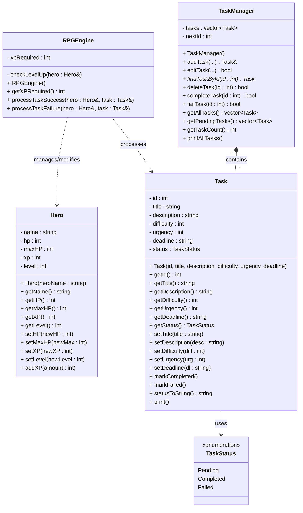

# Focus Dungeon

Focus Dungeon is a gamified productivity application where players complete real-life tasks to
progress in a dungeon-like environment. Each task is assigned importance and urgency levels,
which determine the experience points (EXP) gained upon completion. Failure to complete
tasks on time results in a loss of health points (HP), encouraging consistent productivity
and time managemen

## UML Class Diagram

